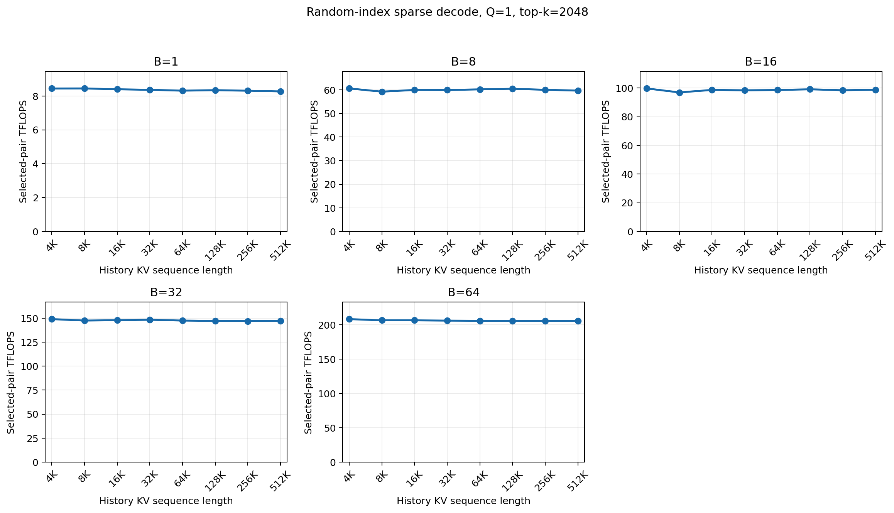
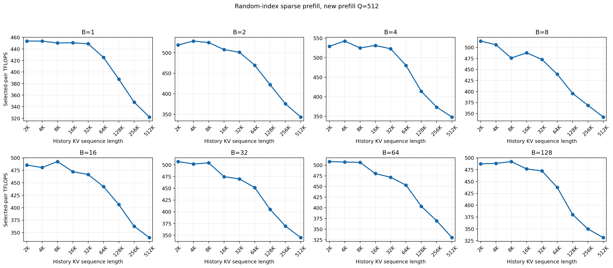
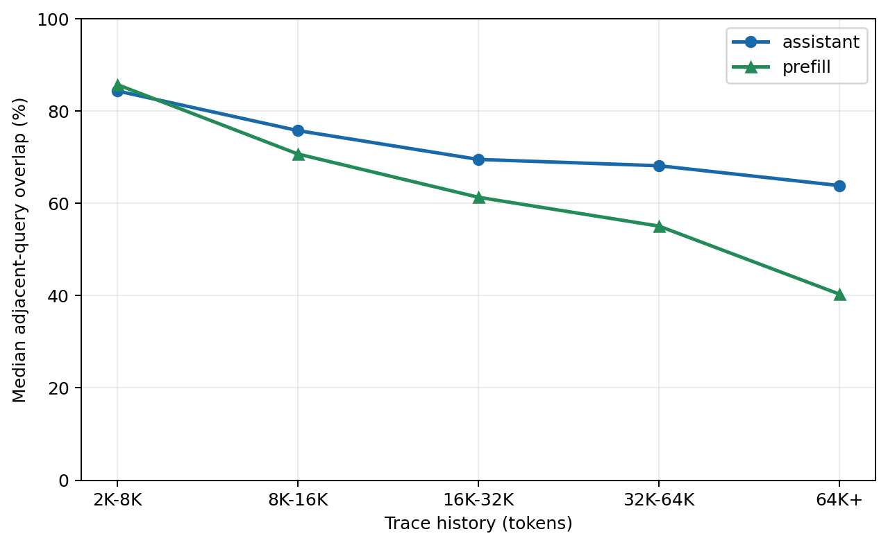
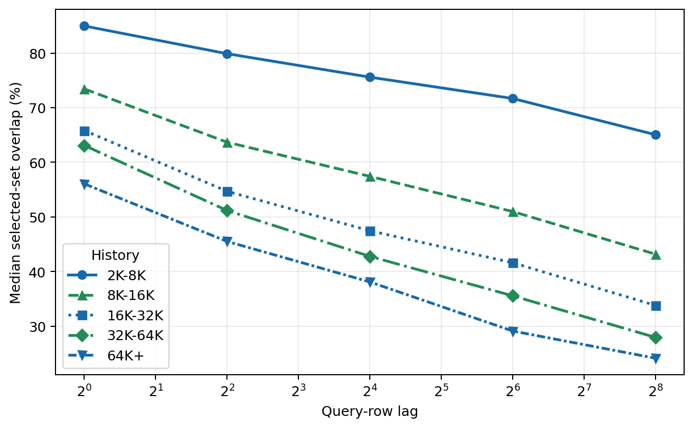
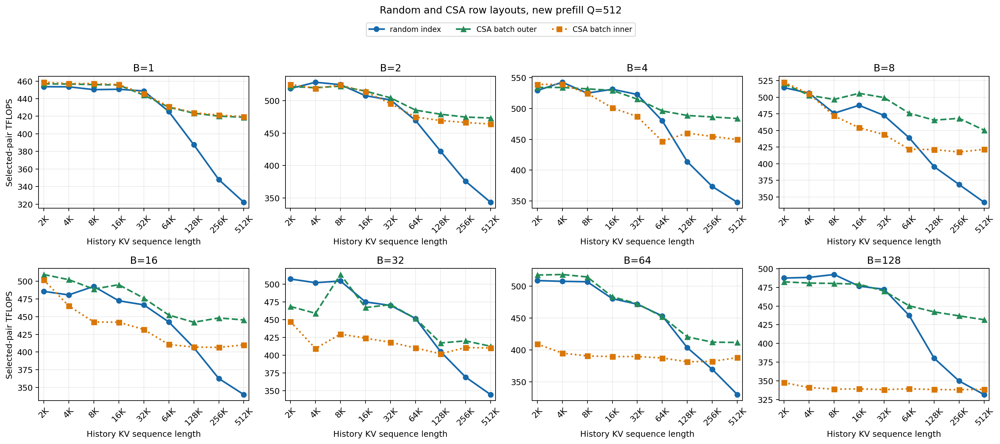

# Sparse MLA Prefill 为何随历史 KV Cache 增长降速？

> 固定 `topk=2048` 后，随机 index decode 的吞吐随可寻址历史增长保持稳定；
> prefill 的吞吐变化与 query 间可复用的 KV 工作集，以及这些 query 在 kernel
> 中的执行邻近性密切相关。

本仓库是一份可复现的微型实验报告。它研究可寻址历史增长是否会引起 token 粒度
稀疏访存的自然降速，以及 SGLang SM90 Q8×KV8 Sparse MLA prefill kernel 在
历史 KV 从 2K 增长到 512K 时吞吐下降的真正来源。我们进一步用公开 CSA trace
构造更接近真实激活规律的 index。

## 摘要

本文包含两个逐层推进的 insight。首先，固定 `topk=2048` 的随机 index decode
在 H 从 4K 增长到 512K 时吞吐基本稳定。Token 粒度、非连续的 KV 访问可能具有
固定的绝对开销；在这组实验中，扩大 index 的可寻址范围带来的吞吐波动低于
`2.9%`。

第二个 insight 聚焦 prefill。基线实验使用确定性的互质步长 index（图中记作
random）。随着历史 KV 长度 H 从 2K 增长到 512K，kernel 完成相同数量
selected-KV attention 计算所需的时间变长，因此 measured TFLOPS 下降。

本文分别记录“计算量”和“数据访问模式”：实验始终固定 `topk=2048`，所以每个
query 实际参与 attention 的 KV 数量始终保持 2,048，按 selected KV 计算的名义
FLOPs 也保持固定。更大的 H 扩大了可被选择的 KV 地址范围，可能改变 index
分布、单次调用访问的 unique KV 数量，以及各 query 之间的数据复用。对公开
CSA trace 的统计进一步显示，相邻 query 的 selected-set overlap 会伴随 H 增长
下降，同时真实激活呈现明显的短程相关性和连续 C4 簇集。

我们先直接 replay 真实 trace 窗口，再将统计规律扩展到完整 `(B,H,Q)` 网格。
CSA simulated/random TFLOPS 中位数为 `1.030x`。保持完全相同的逻辑 index，
将 query row 从 batch-outer 改为 batch-inner 后，高负载
`B>=64,Q>=512` 的吞吐降至 `0.778x`。结果支持：长 history 通过改变激活分布
扩大单次 prefill 的 unique KV 工作集。Query-row 的执行组织决定这些复用能否
被硬件有效利用。

## 1. 问题与口径

实验固定以下 kernel 形状：

| 参数 | 值 |
|---|---:|
| Query heads | 64 |
| Absorbed Q/K dim | 576 |
| Value dim | 512 |
| Selected KV / query | 2,048 |
| Query/KV dtype | FP8 E4M3 |
| Output dtype | BF16 |

图中的吞吐是 selected-pair TFLOPS：

```text
FLOPs = 2 * B * Q * 2048 * 64 * (576 + 512)
TFLOPS = FLOPs / sparse-kernel-time
```

因此横轴 H 增长时，分子保持固定，吞吐曲线的变化直接反映 kernel 时间变化。

主要 prefill 数据来自同一套本机环境：

| 项目 | 设置 |
|---|---|
| GPU | NVIDIA H800 PCIe 80GB，SM90，350W |
| Driver / CUDA | 580.82.07 / PyTorch CUDA 12.8 |
| PyTorch / FlashInfer | 2.9.1+cu128 / 0.6.3 |
| Kernel | SGLang commit `5d85f25f75b6b6c937ac85bdc57ba0d19ebbbd7c` |
| 计时 | 10 次 warmup，30 次 CUDA event，正序/倒序双 pass |

## 2. Insight 1：随机离散访存的 decode 吞吐随 H 保持稳定

先考虑一个更基础的问题：当每个 query 固定读取 2,048 个离散 KV token 时，历史
地址空间从 4K 扩大到 512K，这种 token 粒度的稀疏访问是否足以让 kernel
持续变慢？

我们用 FlashMLA FP8 sparse decode 做对照。每个 sequence 的 `Q=1`，使用
独立的确定性互质步长 index；每次仍读取 2,048 个 KV。为统一每次调用的 cache
起点，每个 timed call 前都读取 256 MiB flush buffer。下图固定
batch size，展示 H 从 4K 到 512K 的绝对 selected-pair TFLOPS。



在 `B={1,8,16,32,64}` 下，512K/4K 吞吐比分别为
`0.980x / 0.985x / 0.991x / 0.988x / 0.989x`；每条曲线全区间的最大波动均低于
`2.9%`。这组结果将随 H 增长的吞吐波动限制在 3% 以内，说明更长的 H 和
更分散的 token 地址对 decode 吞吐的影响很小。

这组实验聚焦随机 index 在各 H 下的相对变化。随机 index 与连续 index 的绝对
开销属于另一项对照；decode 与 prefill 的绝对吞吐也分别对应各自的 kernel。
因此这里的证据边界是：随机离散访存在 decode 中呈现稳定的 history scaling，
prefill 的内部瓶颈由后续实验继续识别。

## 3. Insight 2：Prefill 吞吐在 H 增长过程中下降

下图展示基线实验：固定新增长度 `Q=512`，每个面板固定一个 batch size，
横轴为历史 KV 长度 H，纵轴为绝对 selected-pair TFLOPS。蓝线使用仓库早期所称
的 random index，实际为确定性的互质步长构造。



所有 batch 下都能观察到相同趋势：2K–32K 区间的吞吐相对稳定，H 达到 64K
后开始持续下降。由于每个点的 top-k 和名义 FLOPs 相同，这张图建立了待解释
的现象：更长的 history 使同一 sparse-prefill kernel 完成相同 selected-pair
计算所需的时间增加。后续实验继续识别这一现象的来源。

## 4. CSA 激活规律来自哪里

CSA profile 来自公开数据集
[fxiaoO/deepseek-v4-flash-swebench-csa-topk](https://modelscope.cn/datasets/fxiaoO/deepseek-v4-flash-swebench-csa-topk)。
本仓库从中选取 8 条长度分层 trace，prompt 覆盖约 6.9K–73.7K token。每个
trace row 含 512 个 C4 compressed entry；replay 时每个 entry 展开为 4 个连续
token index，以保持 2,048 top-k 和相同的 set-overlap 比例。

按 history 聚合后，相邻 query overlap 的总体 P50 为：

| History bin | 2K–8K | 8K–16K | 16K–32K | 32K–64K | 64K+ |
|---|---:|---:|---:|---:|---:|
| Adjacent overlap P50 | 85.0% | 73.4% | 65.8% | 63.1% | 56.1% |



Assistant span 在长 history 下保留更多复用，prefill-equivalent span 下降更快。
这种相关性延伸到更远的 query row：query lag 从 1 增长到 256 时，各 history
档的 overlap 都平滑衰减。



由此得到一个待验证的机制猜想：H 增长过程中，每个 query 的 selected-KV 数量
保持 2,048，同时 index 的候选地址空间持续扩大；如果相邻 query 的激活集合变得更少
重叠，那么单次 prefill 需要访问的 unique KV 工作集就会增大，原有的数据复用
也会减弱。Trace 统计为这个机制猜想提供了相关性证据，下面继续用相同 kernel
做 trace replay、完整网格仿真和 row-order 干预。

这些统计数据完整保存在
[`artifacts/data/csa_trace_profile/raw/`](artifacts/data/csa_trace_profile/raw/)，
2.6GB 原始 NPZ 保存在仓库外的本机归档中。

## 5. 从真实窗口到完整网格

### Trace replay

第一步直接截取真实 trace 的 `[H-Q,H)` 窗口并送入相同 Q8KV8 kernel。网格覆盖
`B={1,8,32,128}`、`Q={64,256,1K,2K}` 和
`H={8K,16K,32K,64K}`，得到 64 个完整双 pass 配对。

CSA replay/random TFLOPS 中位数为 `1.020x`；按 H 分组依次为
`1.004x / 1.012x / 1.022x / 1.098x`。短 history 差异很小，64K 时 CSA trace
保留的跨-query复用开始形成稳定收益。完整绝对吞吐图见
[`artifacts/figures/supplement/csa_trace_replay_throughput.png`](artifacts/figures/supplement/csa_trace_replay_throughput.png)。

### CSA profile simulation

为了覆盖 2K–512K，本仓库按 history bin 从 trace 提取三类统计量：

1. 相邻 query 的 selected-entry overlap。
2. Selected entry 相对当前 query 的年龄 CDF。
3. 连续 C4 entry 的簇集比例。

模拟器以 Markov 方式逐 query 生成 512 个 C4 entry，再展开为 2,048 个 token
index；每个 batch element 使用独立 seed，使各 sequence 拥有独立模板。

完整网格为：

```text
B = 1,2,4,8,16,32,64,128
Q = 2,8,32,128,512,1K,4K
H = 2K,4K,8K,16K,32K,64K,128K,256K,512K
```

504 个目标 shape 中有 502 个 random/simulated 配对；另外两个是旧 random
基线的显存边界。全部 1,004 个 CSA case 均有正序和倒序，最终 spread 最大
`4.87%`。Simulated/random 中位数为 `1.030x`。

真实 trace 覆盖到 64K，166 个更长 history 的点固定使用 `64K+` profile。
因此 128K–512K 的结果属于规律外推，真实 trace replay 的范围止于 64K。

## 6. 最终验证：激活分布与 Query row 邻近性

CSA profile 默认的 batch-outer 顺序是：

```text
b0q0, b0q1, ..., b1q0, b1q1, ...
```

我们保持 KV、逻辑 index、FLOPs 和 kernel 完全固定，同步置换 Q 与 indices，
构造 batch-inner：

```text
b0q0, b1q0, ..., b0q1, b1q1, ...
```

逆置换输出后，两种布局逐元素一致，`max_abs=0`。502/502 个 shape 完整配对，
batch-inner 双 pass spread P95/最大值为 `2.98% / 4.69%`。

下图把最初的 random baseline、CSA batch-outer 和 CSA batch-inner 放在同一组
绝对 TFLOPS 纵轴上。三条曲线的 kernel、top-k 和名义 FLOPs 相同；绿色与蓝色
对应两种 index 激活分布，橙色与绿色对应两种 Q/indices row order。



| Batch | 1 | 8 | 16 | 32 | 64 | 128 |
|---|---:|---:|---:|---:|---:|---:|
| Inner/outer TFLOPS | 1.001x | 0.985x | 0.949x | 0.908x | 0.857x | 0.781x |

总体中位数为 `0.974x`；`B>=64,Q>=512` 子集为 `0.778x`。Batch-inner 将同一
sequence 的 query 分隔开，吞吐下降随 batch 显著放大。这个干预保留硬件 L2，
CTA 调度仍由 kernel 决定，因此结果刻画的是 row-order locality；L2 hit/miss
的定量归因需要 NCU counter。

其他 Q 的完整三线图见
[`artifacts/figures/supplement/`](artifacts/figures/supplement/)。

## 7. 结论与边界

本仓库的证据支持以下解释：

- 固定 top-k 后，名义 attention FLOPs 与 H 无关。
- 随机 index decode 在 H=4K–512K 内保持稳定，扩大离散地址范围带来的吞吐波动
  低于 2.9%。
- H 扩大可寻址空间，并伴随 CSA selected-set overlap 和近期 KV 占比下降。
- 激活规律决定一次 prefill 的 unique KV 工作集，对应 random 与 CSA 的曲线差异。
- 同一逻辑 index 下，row order 足以在高 batch/大 Q 时产生约 22% 的吞吐差异。

当前证据来自端到端 kernel timing。L2 miss、HBM traffic、TLB、sector efficiency
和 long-scoreboard stall 的占比需要 NCU counter 进一步分解。本文使用 CSA 作为
DSA 的代理，完整 DSA 实现可能采用其他检索器、top-k 语义和调度策略。

## 复现与数据

CPU 上重新生成全部博客图：

```bash
./bootstrap.sh
PYTHON=.venv/bin/python scripts/reproduce_figures.sh
.venv/bin/python -m tests.test_csa_trace
```

详细 benchmark 命令见 [REPRODUCE.md](REPRODUCE.md)。权威数据约 7MB，按
random baseline、CSA trace profile/replay、batch outer/inner 和 decode control
分类保存在 [`artifacts/data/`](artifacts/data/)。非核心实验和原始 trace 的本机
归档位置与校验值见 [ARCHIVE_MANIFEST.md](ARCHIVE_MANIFEST.md)。

## 引用

- fxiaoO. [*deepseek-v4-flash-swebench-csa-topk*](https://modelscope.cn/datasets/fxiaoO/deepseek-v4-flash-swebench-csa-topk) [Dataset]. ModelScope, accessed 2026-08-14.
- SGLang Q8×KV8 kernel source is vendored from commit `5d85f25f75b6b6c937ac85bdc57ba0d19ebbbd7c`; all eight Git blob hashes are verified before JIT compilation.
