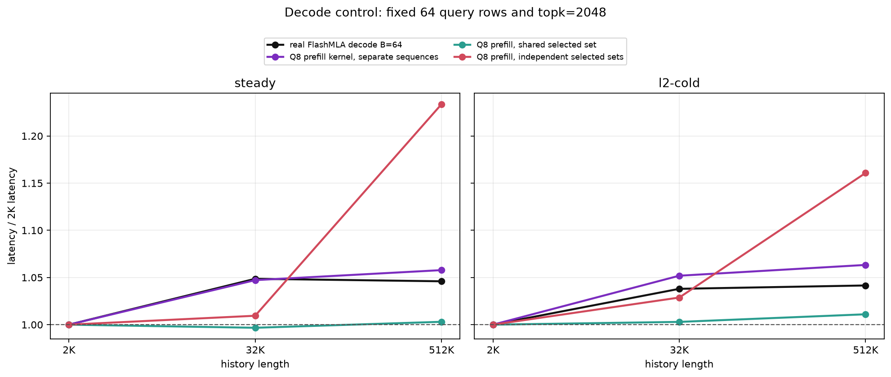
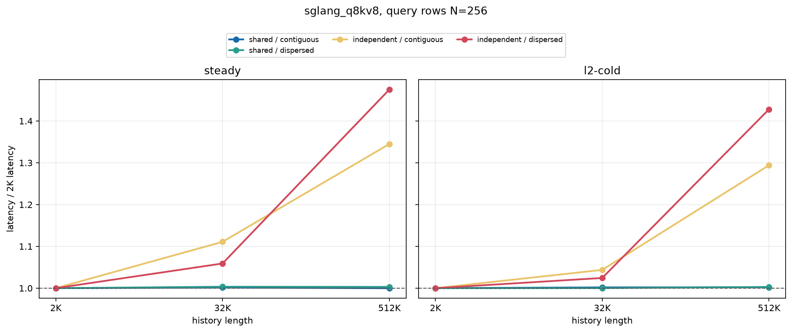
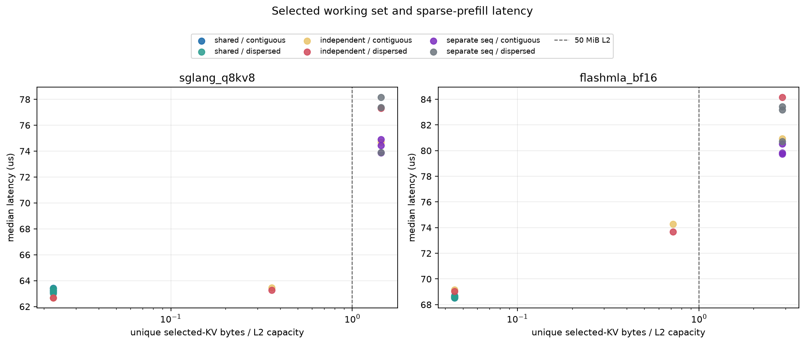

# Sparse MLA Cache-Locality 归因实验

## 问题与待检验假设

原始现象是：固定 `topk=2048` 后，native FlashMLA sparse decode 的延迟几乎
不随 history 增长，而 sparse prefill 的 selected-pair TFLOPS 会随 history
增长而下降。由于每个 query 的名义计算量没有变化，后续实验需要区分以下解释：

1. **H1，可寻址范围效应**：即使读取的 KV 数量不变，仅仅把地址分布在更大的
   history 范围内，也可能增加 TLB、page-walk 或地址生成成本。
2. **H2，跨 query 重用损失**：prefill 的一个调用包含多个 query row；短 history
   时这些 row 选中的 KV 高度重叠，长 history 时 selected set 分化，使一次调用
   内需要读取的 unique KV 数量增加。
3. **H3，空间离散性**：unique KV 数量不变时，离散地址可能降低 coalescing、
   sector efficiency 或 cache-line 利用率。
4. **H4，跨调用缓存驻留**：steady-state 可能受前一次调用残留在 L2 中的数据
   加速，而较大 history 破坏这种驻留。
5. **H5，kernel 类型效应**：下降可能是 sparse prefill kernel 本身的固有行为，
   而不是 query 组织方式造成的。
6. **H6，KV 数据类型效应**：BF16 KV 较大的 token footprint 可能是趋势的来源；
   若是这样，Q8KV8 应显著改变或消除该趋势。

## 实验设计如何分离变量

所有受控 prefill case 固定 `topk=2048`、head shape、kernel 和 query 数量 `N`，
因此 logical pairs 始终是 `N*2048`。只干预 indices 的集合关系和地址排列。
对第 `i` 个 query row，记 selected set 为 `S_i`，记录：

```text
unique_kv       = |union_i S_i|
reuse_factor    = N * 2048 / unique_kv
adjacent_overlap= mean_i(|S_i intersect S_(i-1)| / 2048)
working_set     = unique_kv * bytes_per_KV_token
```

受控 case 的 FLOPs 分子固定，所以本文优先比较 latency：`TFLOPS retention =
1 / latency ratio`。例如 512K/2K 延迟为 1.475x，就等价于吞吐
保留到 0.678x。这样不会把名义 FLOPs 口径误认为额外计算。

四种 shared-sequence pattern 构成主要对照：

| Pattern | 跨 query selected set | 每行内部地址 | 主要检验 |
|---|---|---|---|
| `shared_contiguous` | 完全相同 | 连续 | 基准 |
| `shared_dispersed` | 完全相同 | 互质步长离散 | 在重用固定时检验 H1/H3 |
| `independent_contiguous` | 尽量不同 | 每行连续 | 在空间局部性较好时检验 H2 |
| `independent_dispersed` | 尽量不同 | 互质步长离散 | H2 与 H3 的组合上界 |

另外设置两类负对照：`isolated_*` 把 64 个 query row 放入 64 个独立 sequence，
使其没有同一 sequence 内的跨 query 重用；native FlashMLA FP8 decode `B=64`
提供真实 decode kernel 对照。它们都固定读取 `64*2048` 个 selected KV，只有
底层分配的 history 范围增长。

每个 case 测 steady 和 L2-cold。L2-cold 在每次计时前读取 256 MiB flush
buffer 并同步，flush 不计入 kernel latency；这只针对 50 MiB L2 的跨调用驻留，
不能保证清除或测量所有 TLB 状态。History 以升序和降序各运行一次，每个原始点
10 次 warmup、30 次 CUDA-event measurement，最终取两个 pass median 的 median，
用于限制温度、时钟和运行顺序的混淆。

## 数据完整性与混淆检查

- 204/204 个原始 case 成功，聚合为 102 个受控点。
- 每个聚合点均包含 ascending 和 descending 两个 history-order pass。
- 同一点升降序延迟最大差异为 4.61%。
- 全部配对点的 L2-cold/steady 中位延迟比为
  1.015x。
- 本组 clean run 在两次连续 GPU idle 检查后启动；先前与其他 GPU workload
  重叠的试跑已隔离在 `assets/cache_locality/`，不进入这里的聚合或结论。

## 结果一：扩大 history 并不足以造成下降

下表均为 512K 延迟除以 2K 延迟：

| Case | 512K / 2K 延迟 |
|---|---:|
| Q8, N=256, independent dispersed | 1.475x |
| Q8, N=256, shared dispersed | 1.003x |
| Q8, N=64, independent dispersed | 1.234x |
| Q8, N=64, shared dispersed | 1.003x |
| BF16, N=64, independent dispersed | 1.220x |
| BF16, N=64, shared dispersed | 1.002x |
| Q8 prefill kernel, 64 separate sequences | 1.058x |
| Real FlashMLA FP8 decode, B=64 | 1.046x |

`shared dispersed` 从 2K 到 512K 会把同样 2,048 个 unique KV 从完整的短
context 改为跨越 512K 地址范围的离散采样；`unique_kv` 和跨 query 重用保持
不变，但延迟仅增加 1.003x。64 个独立 sequence 的 Q8 prefill
和真实 decode 即使各自覆盖更大的总 KV allocation，也只增加
1.058x 和 1.046x。因此，**地址范围扩大不是充分条件**；H1
至多解释一个约 5% 量级的残余，不能解释 shared-sequence prefill 的 47.5%。

同一个 Q8 prefill kernel 在 shared-sequence 的 independent pattern 中下降明显，而在 64
个独立 sequence 中近似平坦，也表明 H5“prefill kernel 天生随 history 下降”
不成立。决定趋势的是一次调用内 query rows 如何共享 selected KV，而不是 API
被称为 decode 还是 prefill。



## 结果二：跨 query 重用损失是主要软件可见因素

Q8 `N=256` 的完整 steady-state 数据如下。2K 时 `topk=H`，所有 pattern 都
只能选中全部 2,048 个 KV，因此 unique working set 相同；到 512K 时，shared
仍只读取 2,048 个 unique KV，而 independent 的 selected sets 分化。

| H | Pattern | 延迟 (us) | Unique KV | Reuse | Adjacent overlap | Working set / 50 MiB L2 |
|---:|---|---:|---:|---:|---:|---:|
| 2K | `shared / contiguous` | 116.176 | 2,048 | 256.00x | 100.00% | 0.022x |
| 2K | `shared / dispersed` | 116.128 | 2,048 | 256.00x | 100.00% | 0.022x |
| 2K | `independent / contiguous` | 115.408 | 2,048 | 256.00x | 100.00% | 0.022x |
| 2K | `independent / dispersed` | 115.392 | 2,048 | 256.00x | 100.00% | 0.022x |
| 32K | `shared / contiguous` | 116.352 | 2,048 | 256.00x | 100.00% | 0.022x |
| 32K | `shared / dispersed` | 116.528 | 2,048 | 256.00x | 100.00% | 0.022x |
| 32K | `independent / contiguous` | 128.208 | 32,768 | 16.00x | 93.75% | 0.360x |
| 32K | `independent / dispersed` | 122.208 | 32,768 | 16.00x | 0.00% | 0.360x |
| 512K | `shared / contiguous` | 116.160 | 2,048 | 256.00x | 100.00% | 0.022x |
| 512K | `shared / dispersed` | 116.480 | 2,048 | 256.00x | 100.00% | 0.022x |
| 512K | `independent / contiguous` | 155.216 | 524,288 | 1.00x | 0.00% | 5.760x |
| 512K | `independent / dispersed` | 170.240 | 411,392 | 1.27x | 0.00% | 4.520x |

在 `H=512K,N=256`，保持每行连续、只从 shared 改为 independent，延迟比为
1.336x；在 dispersed 版本中对应为 1.462x。
`independent_contiguous` 的 unique set 为 524,288 个 KV，reuse 从 256x 降至
1x，selected working set 从 L2 的 0.023x 增至 5.760x。这个干预没有改变
logical pairs 或 kernel，因此直接支持 H2：**下降跟随的是一次 kernel invocation
内的 unique selected-KV working set，而不是 history 参数本身。**

`N` 扩大也给出同方向的剂量效应：Q8 independent dispersed 在 `N=64` 时为
1.234x，在 `N=256` 时增至 1.475x；shared 对照分别只有
1.003x 和 1.003x。可失去重用的 query rows 越多，
长 history 惩罚越大。





## 结果三：空间离散性是次要放大项

在 Q8 `N=256,H=512K`：

- `shared dispersed/shared contiguous = 1.003x`。两者 unique KV
  都是 2,048、reuse 都是 256x，这是本实验最干净的“只改变地址离散性”对照。
- `independent dispersed/independent contiguous = 1.097x`，
  表明失去重用后离散地址还会增加约
  9.7% 延迟。

第二个比较不是完美正交：512K 时 independent dispersed 有 411,392 个 unique
KV，而 independent contiguous 有 524,288 个，二者集合冲突结构不同。尽管
dispersed 的 unique 数更少，延迟仍更高，所以结果与额外的空间局部性/
coalescing 成本一致，但不能将这 9.7% 全部
严格归入某一个硬件 counter。结合干净的 shared 对照，H3 存在但量级显著小于
H2 的 33.6%--46.2% 主效应。

## 结果四：不是跨调用 L2 热缓存，也不是 BF16 独有现象

L2-cold/steady 中位比只有 1.015x，而且 cold 与
steady 中 shared/independent 的相对趋势一致。因此 H4 不是主要解释。这个结论
仅排除“前一次 kernel invocation 留在 L2 的数据”作为主因；它不排除单次 kernel
内部的 L2 reuse，而后者正是 shared selected set 能利用的机制。

FlashMLA BF16 `N=64` 复现同一方向：independent dispersed 为
1.220x，shared dispersed 为 1.002x；Q8KV8 对应为
1.234x 和 1.003x。因此 H6 也不成立：FP8 减少每个
KV token 的字节数，会改变绝对吞吐和下降幅度，但不会消除由 selected-set overlap
变化产生的结构性趋势。

## 从实验到最终归因

证据链可以按因果干预归纳为：

1. 固定 logical pairs 和 kernel，只增大 history、保持 shared selected set，趋势
   消失，排除“history 数值/分配范围本身”为主要原因。
2. 固定 history、kernel 和每行连续布局，只把 selected sets 从 shared 改为
   independent，延迟显著上升，定位到跨 query 重用和 unique working set。
3. `N=64 -> 256` 时 independent 惩罚扩大、shared 保持平坦，提供剂量效应。
4. 同一 prefill kernel 的 separate-sequence 对照与真实 decode 都近似平坦，排除
   kernel 名称或 prefill 调度形态本身。
5. L2-cold 没有改变相对结论，排除跨调用缓存驻留；BF16/Q8 都复现趋势，排除
   单一 KV dtype。
6. 在 overlap 固定时改变地址排列只产生很小差异；离散性在 overlap 已丢失后
   进一步放大延迟，因此它是次要因素而非首要因素。

所以对**当前 deterministic synthetic indices benchmark**，可以归因到的软件层
结论是：

> 长 history 使同一 prefill chunk 内相邻 query 的 selected-KV overlap 下降，
> 从而扩大单次 kernel 需要服务的 unique KV working set；空间离散性进一步
> 增加 memory-hierarchy pressure。Decode 每个 sequence 每次只有一个 query，
> 没有一组随 history 增长而逐渐丢失的同序列跨-query重用，因此其延迟基本平坦。

这不是“低带宽利用率只会在 prefill 出现”的一般规律。如果 decode 的一个调用
也具有可随 workload 改变的跨 query KV 共享，或者 selected count/unique working
set 随 history 增长，它同样可能下降；反过来，当 prefill 保持 shared selected
set 时，本实验已经观察到它基本不下降。

## 归因边界

该实验在软件输入层进行了实际干预，因此能识别 selected-set overlap/unique
working set 的主效应，但没有 NCU，无法把最终硬件停顿拆分成 HBM bytes、L2
miss、TLB/page walk、memory-sector efficiency 或 long-scoreboard stall。准确
表述应是“memory-hierarchy pressure 增加”，而不是“已经测得带宽利用率降低”。

此外，2K 基线有 `topk=H`，天然强制所有 selected sets 完全重合；512K 的
independent pattern 则由合成互质步长构造。真实 indexer trace 可能在相邻 query
间保留更高 overlap，也可能呈现不同的聚簇结构。因此已经验证的是当前 benchmark
现象的机制；若要推广到端到端 serving，下一步必须采集真实 indices trace，并按
`unique_kv/reuse_factor/adjacent_overlap` 分桶复测。
