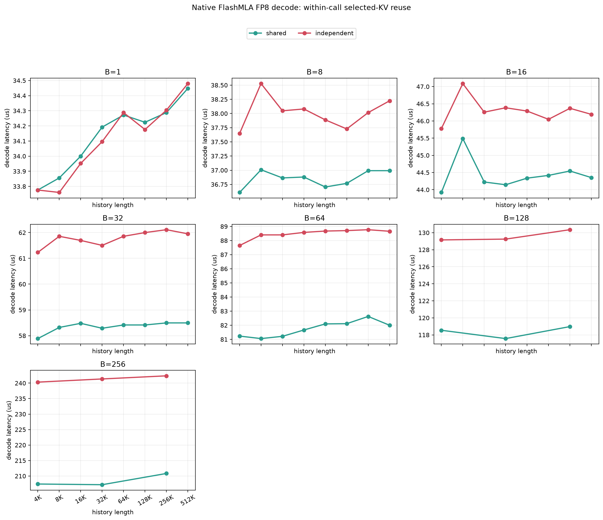
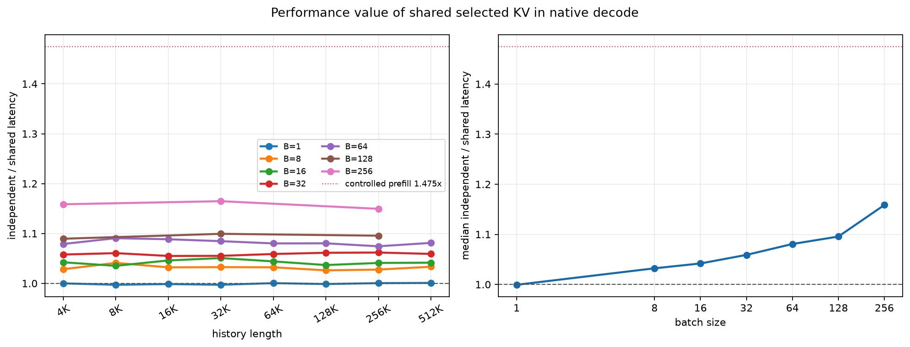

# Native Sparse Decode Selected-KV Reuse

## 实验设计

本实验不再尝试用不同的前置 kernel 制造“100% L2 hit/miss”，因为无 NCU 无法
验证 hit rate，而且前置 workload 会混入 DVFS。这里使用单次 native FlashMLA
FP8 sparse decode kernel 内的因果干预：

- `shared`：所有 batch row 读取同一组 2,048 个物理 KV；
- `independent`：每个 batch row 读取各自独立的 2,048 个物理 KV。

两者使用同一份 Q/KV allocation、同一 kernel、batch、topk、FLOPs 和计时流程。
每次 timed call 前都执行完全相同的 256 MiB flush，因此立即前置 workload 和
clock conditioning 相同。只改变 timed kernel 内的 unique selected-KV working
set。History 为 `4K..512K` 的 2 倍递增序列，做 ascending/descending 两遍；
每点 5 warmup、30 repeat。

原始 full run 中 `B=1,H=64K` 和 `B=64,H=256K/512K` 出现超过 5% 的升降序绝对延迟漂移。这些 shape 在无外部 CUDA process 条件下以 50 repeat 重测，以下聚合显式使用 rerun 覆盖原始异常点。

为与 controlled prefill 的 `N=256` 对齐，另补测 `B=128/256` 的 `H=4K/32K/256K`；这些点同样做两个顺序 pass。B<=64 保留完整的八个 history 点。

## 完整结果

| B | H | Shared unique KV | Independent unique KV | Shared us | Independent us | Ind/Shared |
|---:|---:|---:|---:|---:|---:|---:|
| 1 | 4K | 2,048 | 2,048 | 33.776 | 33.776 | 1.000x |
| 1 | 8K | 2,048 | 2,048 | 33.856 | 33.760 | 0.997x |
| 1 | 16K | 2,048 | 2,048 | 34.000 | 33.952 | 0.999x |
| 1 | 32K | 2,048 | 2,048 | 34.192 | 34.096 | 0.997x |
| 1 | 64K | 2,048 | 2,048 | 34.272 | 34.288 | 1.000x |
| 1 | 128K | 2,048 | 2,048 | 34.224 | 34.176 | 0.999x |
| 1 | 256K | 2,048 | 2,048 | 34.288 | 34.304 | 1.000x |
| 1 | 512K | 2,048 | 2,048 | 34.448 | 34.480 | 1.001x |
| 8 | 4K | 2,048 | 16,384 | 36.608 | 37.648 | 1.028x |
| 8 | 8K | 2,048 | 16,384 | 37.008 | 38.528 | 1.041x |
| 8 | 16K | 2,048 | 16,384 | 36.864 | 38.048 | 1.032x |
| 8 | 32K | 2,048 | 16,384 | 36.880 | 38.080 | 1.033x |
| 8 | 64K | 2,048 | 16,384 | 36.704 | 37.888 | 1.032x |
| 8 | 128K | 2,048 | 16,384 | 36.768 | 37.728 | 1.026x |
| 8 | 256K | 2,048 | 16,384 | 36.992 | 38.016 | 1.028x |
| 8 | 512K | 2,048 | 16,384 | 36.992 | 38.224 | 1.033x |
| 16 | 4K | 2,048 | 32,768 | 43.920 | 45.776 | 1.042x |
| 16 | 8K | 2,048 | 32,768 | 45.488 | 47.088 | 1.035x |
| 16 | 16K | 2,048 | 32,768 | 44.224 | 46.256 | 1.046x |
| 16 | 32K | 2,048 | 32,768 | 44.144 | 46.384 | 1.051x |
| 16 | 64K | 2,048 | 32,768 | 44.336 | 46.288 | 1.044x |
| 16 | 128K | 2,048 | 32,768 | 44.416 | 46.048 | 1.037x |
| 16 | 256K | 2,048 | 32,768 | 44.544 | 46.368 | 1.041x |
| 16 | 512K | 2,048 | 32,768 | 44.352 | 46.192 | 1.041x |
| 32 | 4K | 2,048 | 65,536 | 57.888 | 61.232 | 1.058x |
| 32 | 8K | 2,048 | 65,536 | 58.320 | 61.856 | 1.061x |
| 32 | 16K | 2,048 | 65,536 | 58.480 | 61.696 | 1.055x |
| 32 | 32K | 2,048 | 65,536 | 58.288 | 61.504 | 1.055x |
| 32 | 64K | 2,048 | 65,536 | 58.416 | 61.856 | 1.059x |
| 32 | 128K | 2,048 | 65,536 | 58.416 | 62.000 | 1.061x |
| 32 | 256K | 2,048 | 65,536 | 58.496 | 62.112 | 1.062x |
| 32 | 512K | 2,048 | 65,536 | 58.496 | 61.952 | 1.059x |
| 64 | 4K | 2,048 | 131,072 | 81.232 | 87.648 | 1.079x |
| 64 | 8K | 2,048 | 131,072 | 81.056 | 88.400 | 1.091x |
| 64 | 16K | 2,048 | 131,072 | 81.216 | 88.400 | 1.088x |
| 64 | 32K | 2,048 | 131,072 | 81.664 | 88.576 | 1.085x |
| 64 | 64K | 2,048 | 131,072 | 82.096 | 88.672 | 1.080x |
| 64 | 128K | 2,048 | 131,072 | 82.112 | 88.704 | 1.080x |
| 64 | 256K | 2,048 | 131,072 | 82.624 | 88.768 | 1.074x |
| 64 | 512K | 2,048 | 131,072 | 82.000 | 88.656 | 1.081x |
| 128 | 4K | 2,048 | 262,144 | 118.544 | 129.152 | 1.089x |
| 128 | 32K | 2,048 | 262,144 | 117.568 | 129.248 | 1.099x |
| 128 | 256K | 2,048 | 262,144 | 118.976 | 130.352 | 1.096x |
| 256 | 4K | 2,048 | 524,288 | 207.424 | 240.320 | 1.159x |
| 256 | 32K | 2,048 | 524,288 | 207.200 | 241.344 | 1.165x |
| 256 | 256K | 2,048 | 524,288 | 210.832 | 242.352 | 1.150x |

按 batch 汇总：

| B | Median ratio | Min | Max |
|---:|---:|---:|---:|
| 1 | 0.999x | 0.997x | 1.001x |
| 8 | 1.032x | 1.026x | 1.041x |
| 16 | 1.042x | 1.035x | 1.051x |
| 32 | 1.059x | 1.055x | 1.062x |
| 64 | 1.081x | 1.074x | 1.091x |
| 128 | 1.096x | 1.089x | 1.099x |
| 256 | 1.159x | 1.150x | 1.165x |

升降序单点最大 latency spread 为 `3.38%`。全部点最大
independent/shared 为 `1.165x`，B=64 的 history 中位比为
`1.081x`。

## 归因

`B=1` 时 shared 与 independent indices 完全相同，因此应为 1.0x，它是协议的
零效应校验。随着 batch 增长，logical pairs 不变，但 independent unique KV 从
2,048 增加到 `B*2048`；若 latency ratio 随 batch 增大，说明 native decode
kernel 确实能利用 batch rows 之间的 selected-KV 重用。这里的收益发生在单次
kernel 内，不依赖前一次调用残留的 L2。

此前 controlled prefill 的最大 history ratio 为 `1.475x`。本实验
最大 decode reuse ratio 为 `1.165x`。因此可以判断“decode 完全不能从
L2/缓存重用获益”是否错误，同时也能判断仅靠共享 selected KV 是否足以复现
prefill 的 47.5% 差异。

## 边界

该实验直接控制 unique physical KV addresses，但没有测量 L2 hit counter。
Shared 的速度提升可以归因于 memory-hierarchy reuse 的软件输入条件，不能进一步
声明其中多少来自 L2、L1、memory coalescing、广播或 HBM traffic reduction。
此外，普通 serving decode 的不同 sequence 通常不会故意读取同一物理 KV；
shared 模式是用于量化“可复用时的性能上限”的诊断对照，不是实际调度语义。
